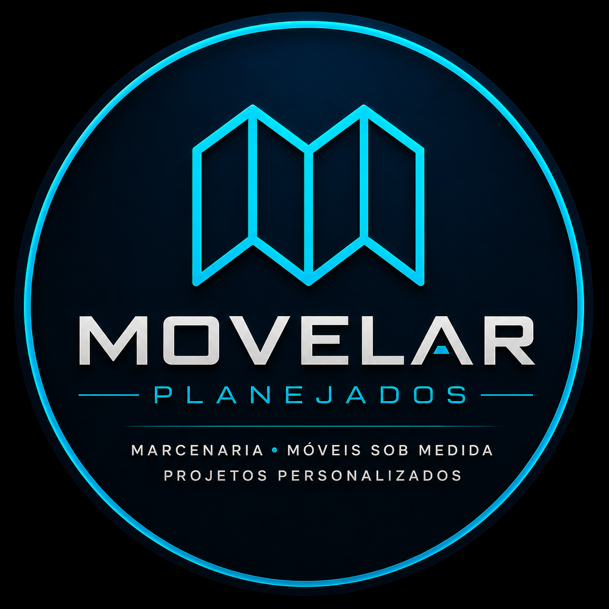

# 🏡 Movelar Planejados | Website para Marcenaria e Móveis Planejados

<p align="center">



</p>

<p align="center">


</p>

---

# 🌐 Sobre o Projeto

🔗 **Projeto online**

👉🏻 https://movelar-planejados.vercel.app/

A **Movelar Planejados** é uma aplicação web institucional desenvolvida para representar digitalmente uma empresa especializada em móveis planejados, marcenaria personalizada e projetos de alto padrão.

O projeto foi idealizado para proporcionar uma experiência moderna, intuitiva e altamente responsiva, transmitindo credibilidade e profissionalismo desde o primeiro acesso.

Durante o desenvolvimento foram aplicados conceitos de UX/UI Design, otimização de desempenho, SEO, animações suaves, responsividade e integração com serviços externos.

💡 **Destaque**

Este projeto foi desenvolvido com foco em simular um ambiente corporativo real, demonstrando habilidades em desenvolvimento Front-end moderno e boas práticas de programação.

---

# 🎥 Fotos do Projeto


<br/>

* Intro animada
* Home
* Projetos
* Vídeos
* Avaliações
* Localização
* Contato
* Footer

---

# ✨ Funcionalidades

✅ Intro Premium Animada

✅ Layout moderno e responsivo

✅ Menu Mobile

✅ Navegação suave entre seções

✅ Scroll Reveal

✅ Contadores animados

✅ Galeria de projetos

✅ Galeria de vídeos

✅ Integração com Google Maps

✅ Formulário funcional utilizando EmailJS

✅ Botão direto para WhatsApp

✅ SEO otimizado

✅ Open Graph para redes sociais

✅ Meta Tags para indexação

✅ Interface moderna utilizando Glassmorphism

✅ Efeitos Hover

✅ Microinterações

✅ Estrutura organizada e comentada

✅ Código limpo e escalável

✅ Compatível com Desktop, Tablet e Smartphones

---

# 🛠️ Tecnologias Utilizadas

## 🎨 Front-end

* HTML5
* CSS3
* JavaScript (ES6+)

## 📚 APIs e Serviços

* EmailJS
* Google Maps Embed

## 🎯 Conceitos Aplicados

* HTML Semântico
* Responsividade
* Flexbox
* CSS Grid
* CSS Variables
* Glassmorphism
* UX/UI Design
* SEO On Page
* Open Graph
* Meta Tags
* DOM Manipulation
* Intersection Observer
* Scroll Animations
* Mobile First
* Performance Optimization

---

# 📱 Responsividade

O projeto foi desenvolvido utilizando técnicas modernas de responsividade para proporcionar uma excelente experiência em qualquer dispositivo.

## Compatibilidade

✅ Desktop

✅ Notebook

✅ Tablet

✅ Smartphones Android

✅ iPhone

---

# 📂 Estrutura do Projeto

```bash
📦 movelar-planejados
│
├── 📂 assets
│   ├── 🖼 imagens
│   ├── 🎥 vídeos
│   ├── 🎨 ícones
│   ├── 🏷 logos
│   └── 📱 redes sociais
│
├── 📄 index.html
├── 🎨 styles.css
├── ⚙ javascript.js
└── 📘 README.md
```

---

# 🎨 Design do Projeto

O layout foi desenvolvido buscando transmitir elegância, modernidade e credibilidade para representar uma empresa de móveis planejados.

Foram utilizados conceitos como:

✨ Glassmorphism

✨ Gradientes modernos

✨ Tipografia Premium

✨ Animações suaves

✨ Hover Effects

✨ Cards Interativos

✨ Botões Estratégicos

✨ Hierarquia Visual

✨ Layout Institucional

✨ Alto contraste para melhor leitura

---

# ⚡ Performance

Durante o desenvolvimento foram adotadas diversas práticas para otimizar o desempenho da aplicação.

## Otimizações implementadas

✅ HTML semântico

✅ CSS organizado

✅ JavaScript modular

✅ Lazy Loading em mapas

✅ Estrutura otimizada

✅ Organização de Assets

✅ Código comentado

✅ Responsividade otimizada

✅ Scroll Reveal utilizando Intersection Observer

✅ Redução de repaints desnecessários

---

# 🔍 SEO

O projeto também recebeu otimizações para mecanismos de busca.

### Implementações

✅ Meta Description

✅ Meta Keywords

✅ Canonical URL

✅ Open Graph

✅ Twitter Cards

✅ Robots

✅ Language

✅ Theme Color

✅ Apple Mobile Web App

✅ Estrutura HTML Semântica

✅ Imagens com atributo ALT

---

# 📧 Formulário Inteligente

A seção de contato possui integração com o **EmailJS**, permitindo que as mensagens enviadas pelo visitante sejam entregues diretamente ao e-mail da empresa sem necessidade de um servidor Back-end.

### Recursos

📨 Envio em tempo real

✅ Feedback visual durante o envio

✅ Mensagem de sucesso

✅ Tratamento de erros

✅ Reset automático do formulário

---

# 🗺 Localização

O projeto possui integração com o **Google Maps**, permitindo que os clientes encontrem facilmente a empresa.

Recursos disponíveis:

📍 Mapa incorporado

🚗 Botão "Traçar Rota"

📞 Telefones de contato

📍 Endereço da empresa

🕒 Horário de funcionamento

---

# 🚀 Funcionalidades Implementadas

Durante o desenvolvimento foram implementadas diversas funcionalidades voltadas para experiência do usuário, performance e identidade visual da empresa.

### 🏠 Página Inicial

* Intro Premium animada
* Hero Section moderna
* Botões estratégicos para conversão
* Design responsivo

### 🏢 Sobre a Empresa

* Contadores animados
* Informações institucionais
* Layout em duas colunas
* Scroll Reveal

### 🪵 Projetos

* Cards modernos
* Hover Effects
* Galeria responsiva
* Layout otimizado

### 🎥 Vídeos

* Cards para apresentação dos projetos
* Estrutura preparada para expansão
* Layout responsivo
* Botão "Ver Mais Projetos"

### ⭐ Avaliações

* Cards modernos
* Layout responsivo
* Animações suaves

### 📍 Localização

* Google Maps integrado
* Telefones
* Endereço
* Horário de funcionamento
* Botão para traçar rota

### 📨 Contato

* Integração com EmailJS
* Feedback visual durante envio
* Campos validados
* Botão WhatsApp

### 📱 Footer

* Navegação rápida
* Redes sociais
* Informações da empresa
* Direitos autorais

---

# 📸 Estrutura Visual do Projeto

O site foi organizado para proporcionar uma navegação intuitiva e agradável.

```text
🏡 Home

      ↓

🏢 Sobre

      ↓

🪵 Projetos

      ↓

🎥 Vídeos

      ↓

⭐ Avaliações

      ↓

📍 Localização

      ↓

📨 Contato

      ↓

📱 Footer
```

---

# 📈 Melhorias Futuras

O projeto foi desenvolvido pensando em escalabilidade. Algumas melhorias previstas são:

🚀 Sistema de agendamento online

🚀 Área administrativa

🚀 Painel de gerenciamento de projetos

🚀 Integração com banco de dados

🚀 Cadastro de clientes

🚀 Login administrativo

🚀 Upload de imagens pelo painel

🚀 Dashboard de métricas

🚀 Blog institucional

🚀 Integração com Instagram

🚀 Catálogo completo de móveis planejados

🚀 Modo escuro

🚀 Internacionalização (Português/Inglês)

---

# 📚 Aprendizados

Durante o desenvolvimento deste projeto foram aprofundados conhecimentos em:

* HTML5 Semântico
* CSS3 Moderno
* JavaScript ES6+
* Manipulação do DOM
* Responsividade
* Flexbox
* CSS Grid
* Scroll Reveal
* Intersection Observer
* Animações CSS
* Organização de código
* Estruturação de projetos Front-end
* Integração com EmailJS
* SEO para aplicações web
* UX/UI Design
* Performance Web

---

# 🎯 Objetivo

Este projeto foi desenvolvido com o propósito de representar digitalmente uma empresa do segmento de móveis planejados, demonstrando como um site institucional moderno pode fortalecer a presença online de um negócio.

Além disso, este projeto faz parte do meu portfólio profissional, evidenciando minhas habilidades no desenvolvimento de interfaces modernas, responsivas e focadas na experiência do usuário.

---

# 👨‍💻 Autor

## Paulo Ricardo

Desenvolvedor Full Stack, apaixonado por tecnologia, interfaces modernas e soluções digitais.

Meu objetivo é criar aplicações que unam design, performance e usabilidade, proporcionando experiências intuitivas e profissionais.

### 💼 Especialidades

* Desenvolvimento Front-end
* HTML5
* CSS3
* JavaScript
* React (em aprendizado)
* Node.js (em aprendizado)
* Git & GitHub
* UX/UI Design

---

# 🤝 Contato

📧 **E-mail**

> [contato@movelarplanejados.com.br](mailto:contato@movelarplanejados.com.br)

📱 **WhatsApp**

> https://wa.me/5585987942034

💻 **GitHub**

> https://github.com/paulopkj

💼 **LinkedIn**

> https://linkedin.com/in/fullstack-paulo-ricardo

---

# ⭐ Gostou do projeto?

Se este projeto foi útil para você ou serviu como inspiração, considere deixar uma ⭐ no repositório.

Esse pequeno gesto ajuda a aumentar a visibilidade do projeto e incentiva o desenvolvimento de novos trabalhos.

---

# 📄 Licença

Este projeto está licenciado sob a **MIT License**.

Sinta-se à vontade para estudar, utilizar como referência e contribuir com melhorias.

---

<div align="center">

## ⭐ Muito obrigado pela visita!

### Desenvolvido com dedicação por **Paulo Ricardo** 🚀

**"Transformando ideias em experiências digitais modernas."**

</div>